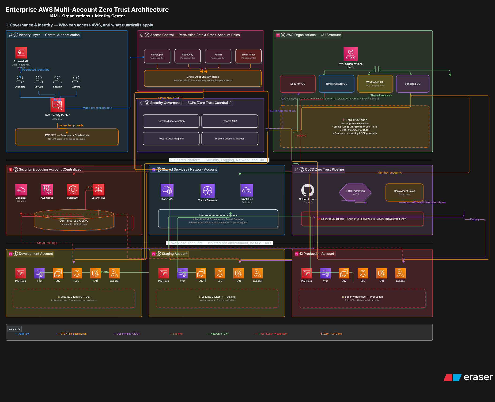

# zero-trust-terraform
AWS IAM Multiple Account Zero Trust Project(Enterprise Level)

## Architecture Diagram
 

## 
AWS Enterprise Multi-Account Zero Trust Architecture
Project Summary

This project demonstrates the design and implementation of an enterprise-grade AWS multi-account environment built using Zero Trust security principles and AWS best practices. It showcases a secure, scalable cloud architecture with centralized identity management, account isolation, network segmentation, infrastructure as code, and continuous security monitoring.

Key Highlights
Enterprise AWS multi-account architecture using AWS Organizations
Zero Trust security model with least-privilege access and MFA
Centralized logging, monitoring, and security governance
Secure networking with account and workload isolation
Infrastructure as Code (Terraform/CloudFormation)
Automated security controls and compliance monitoring
Designed following the AWS Well-Architected Framework and industry security best practices
Skills Demonstrated

AWS Organizations • IAM • IAM Identity Center • CloudTrail • AWS Config • Security Hub • GuardDuty • VPC Networking • Infrastructure as Code • Cloud Security • Zero Trust Architecture • Governance • Automation • Enterprise Cloud Architecture

This project reflects the type of cloud infrastructure used in enterprise environments and demonstrates hands-on experience designing secure, scalable, and production-inspired AWS solutions suitable for Cloud Engineer, Solutions Architect, DevSecOps, and Cloud Security Engineer roles.
